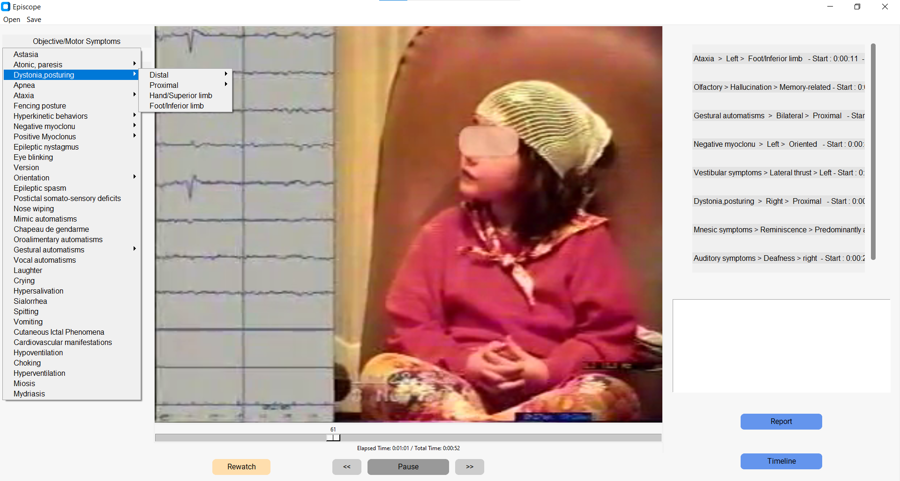

<!-- PROJECT LOGO -->
 

  
  <h1 align="center">EpiScope</h1>

**Episcope** is a GUI featuring ergonomic tools for annotating epileptic seizure videos. 

These tools enable practitioners to note directly on their patients' epileptic seizure videos the various symptoms that appear, thanks to a pre-configured symptom semiology. This interface generates a .txt text file listing all the symptoms occurring during the seizure in chronological order, as well as a timeline illustrating the patient's epileptic seizure. The timeline follows a temporal axis (identical to that of the seizure video) and indicates the moment of onset and end of each symptom. Practitioners must also be able to modify the .txt file and the frieze in the event of an oversight or readjustment.

 

  
  <h1 align="center">EpiScope</h1>

**Documentation :** 
-----------------
  You can find the official Episcope documentation here : https://episcope.readthedocs.io/en/latest/

**Installation :**
----------------
Make sure you have the complete repository whith all dependencies installed.
In the *Episcope/* folder, you can use the command 

`pyinstaller --onefile --icon=.\docs\source\images\logo_cerveau.png  -w ./src/general_interface_V9.py`
